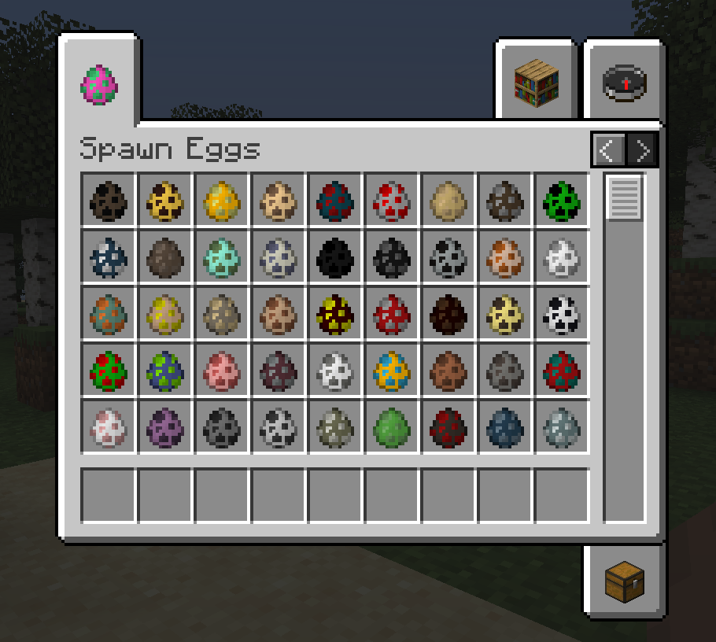

#  Egg Tab

Click [here](https://github.com/florensie/eggtab-forge) for the Forge version of this repo.

Egg Tab is a client-side Minecraft mod that moves all mob spawn eggs to a new "Spawn Eggs" creative tab. It also adds an "Enchanted Books" tab.
Both tabs can be toggled (through mod menu or config file). This mod also works with mods that add additional spawn eggs.

## Screenshot

Here is a picture showing the tabs in action:

